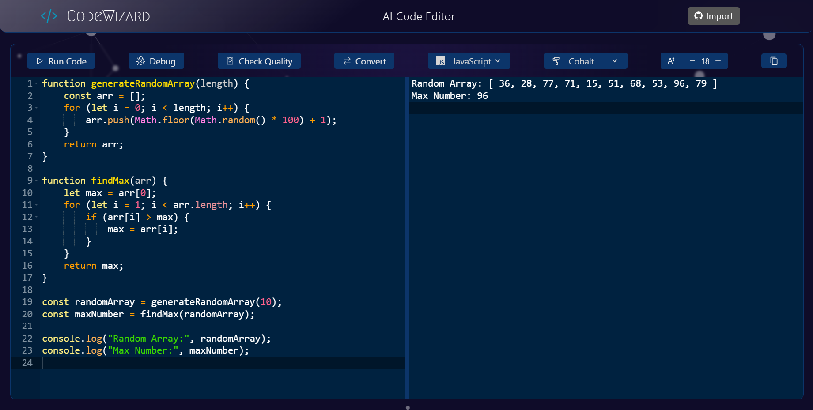
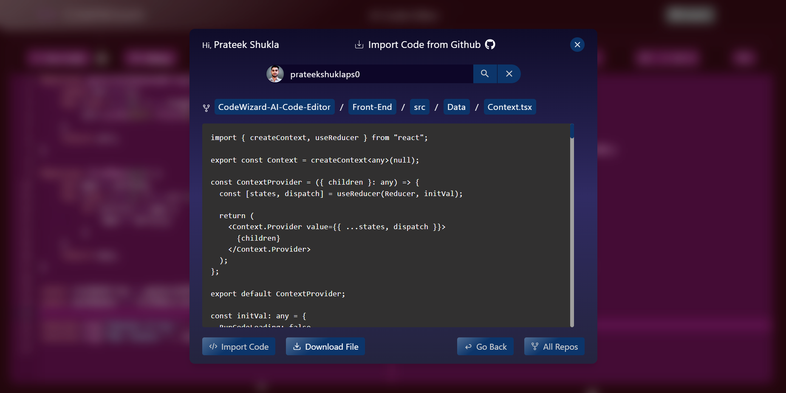
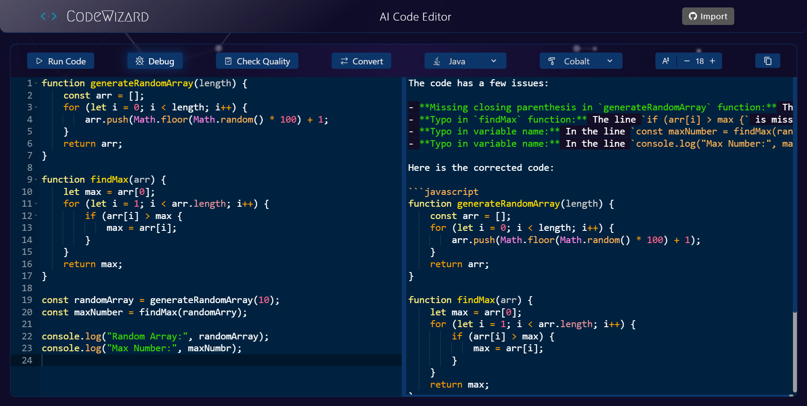
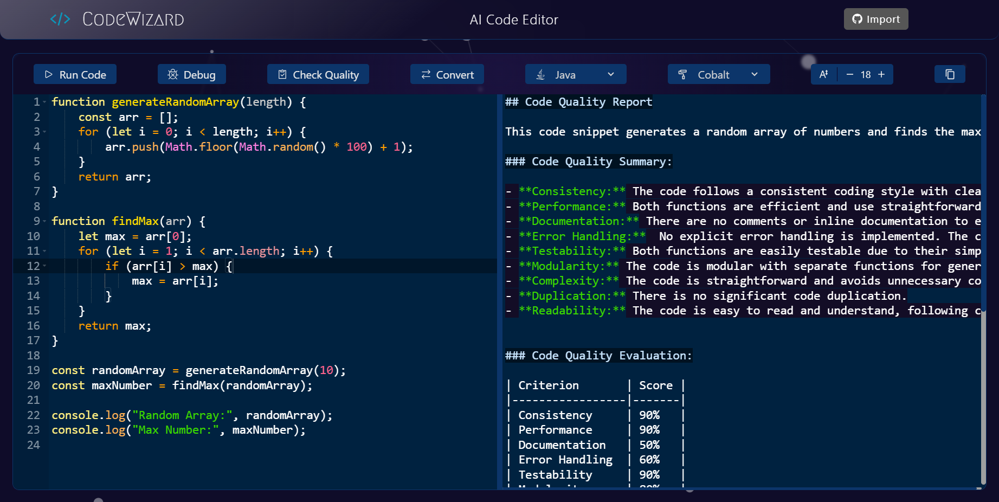
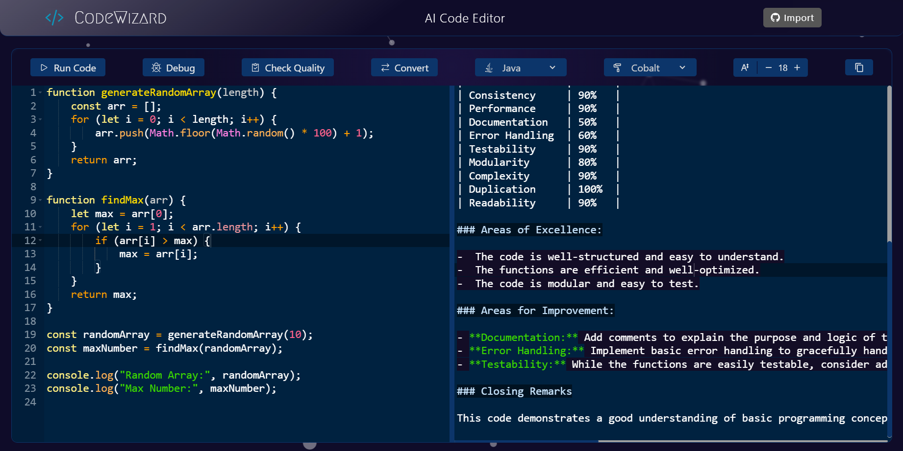
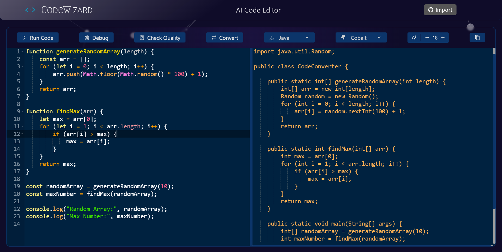

# CodeWizard

#### CodeWizard is a full-stack web-based code editor that leverages AI to enhance your coding experience. It allows users to write, run, debug, and convert code across multiple programming languages. Additionally, it offers code quality checks and integration with GitHub for easy code importing. Built with React, TypeScript, Node.js, and Chakra UI, CodeWizard provides a responsive, user-friendly interface that supports a variety of devices.

## **Key Features** :

- **AI-Powered Code Execution :** Seamlessly run code in any programming language.
- **Cross-Language Code Conversion :** Convert code from one language to another with ease.
- **Intelligent Debugging :** Automatically debug code and receive explanations for the fixes.
- **Comprehensive Code Quality Analysis :** Get a detailed quality assessment of your code based on various parameters.
- **GitHub Code Importing :** Easily import and manage code from your GitHub repositories.
- **Customizable User Interface :** Tailor the editor's appearance with multiple themes and adjustable font sizes.
- **Responsive Design :** Fully responsive and compatible with all devices.

## Tech Stacks Used :

## **Key Entities** :

- **User Input Editor :** The main area where users write or import their code.
- **Output Editor :** Displays the output generated by AI.
- **Action Buttons :** Includes options for running, converting, debugging code, and checking code quality.
- **GitHub Integration :** Allows users to import code directly from their GitHub repositories and download files.
- **Customization Options :** Offers theme selection, font size adjustment, and clipboard copying.

## **Installation & Getting Started** :

1. Clone repository: **`git clone https://github.com/prateekshuklaps0/CodeWizard-AI-Code-Converter`**
2. Install dependencies: **`cd Front-End`**, **`npm install`**
3. Start the front-end server: **`npm run dev`**

<h3 align="center">Dynamic Code Execution</h3>

<h3 align="center">Effortless GitHub Code Integration</h3>

<h3 align="center">Seamless Debugging Insights</h3>

<h3 align="center">AI-Powered Code Evaluation</h3>

<h3 align="center">Instant Code Language Translation</h3>

<h3 align="center">Multi-Programming Language Support</h3>

<h3 align="center">Various Themes Selection Options</h3>

