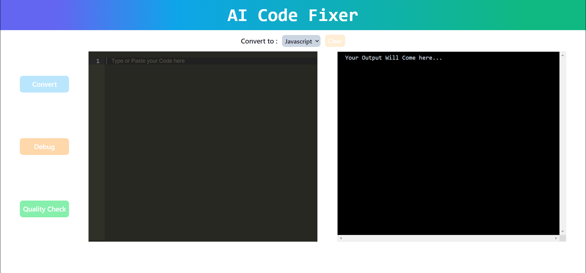

# AI Code Fixer Application

Welcome to the AI Code Fixer application! This tool is designed to assist developers in debugging their code, converting it into different programming languages, and evaluating code quality based on specific parameters.



## Features

### Code Debugging
The application can identify and help resolve errors in your code, making the debugging process faster and more efficient.

### Code Conversion
Convert your code into various programming languages using our AI-powered translation capabilities.

### Code Quality Evaluation
Evaluate your code based on predefined parameters to ensure best practices and high-quality standards.

## Getting Started

### Installation
To run the AI Code Fixer application locally, follow these steps:

1. Clone this repository.
2. Install dependencies for the Node.js backend:
```
cd backend
npm install
```
3. Install dependencies for the React frontend:
```
cd frontend
npm install
```

### Usage
1. Start the backend server:
```
cd backend
npm start
```
2. Start the frontend:
```
cd frontend
npm start
```
3. Access the application in your web browser at `http://localhost:3000`.

## Usage Examples

### Debugging Code
1. Enter your code snippet into the provided editor.
2. Click on the "Debug" button to identify and fix any errors in the code.

### Code Conversion
1. Select the desired programming language from the dropdown menu.
2. Paste your code and click on the "Convert" button to translate it into the selected language.

### Code Quality Evaluation
1. Input your code into the editor.
2. Click on the "Evaluate" button to assess the code quality based on predefined parameters.

## Contributing
Contributions are welcome! If you'd like to contribute to the project, please follow these steps:

1. Fork the repository.
2. Create your feature branch: `git checkout -b feature/NewFeature`
3. Commit your changes: `git commit -m 'Add a new feature'`
4. Push to the branch: `git push origin feature/NewFeature`
5. Submit a pull request.


## Contact
If you have any questions or suggestions, feel free to contact us at [mohnish201@gmail.com](mailto:mohnish201@gmail.com).

