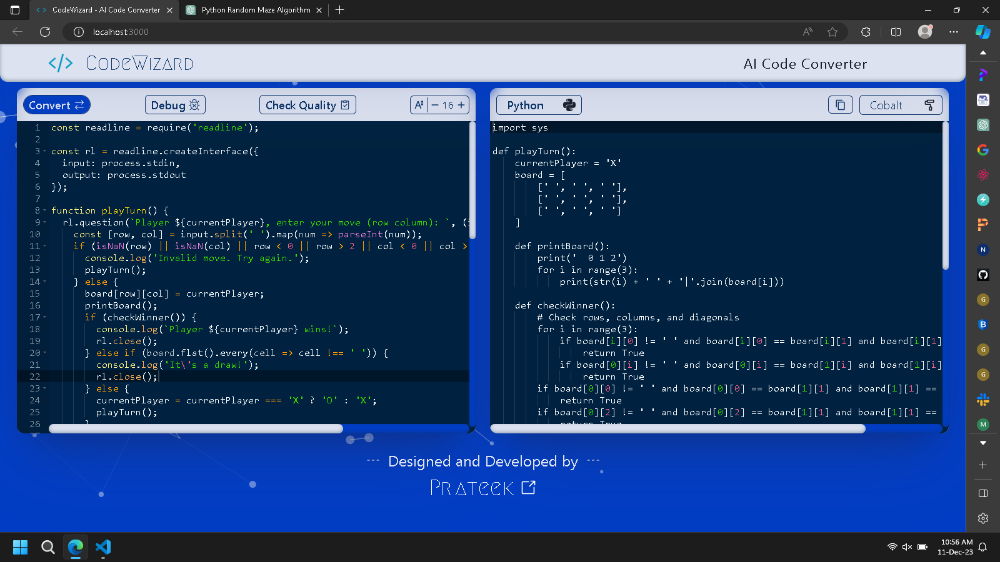
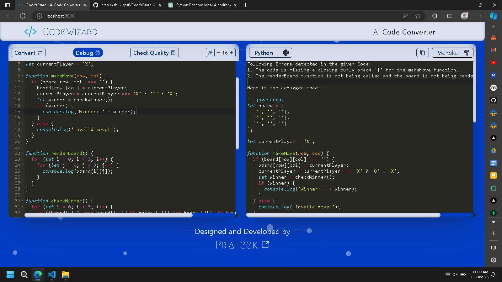
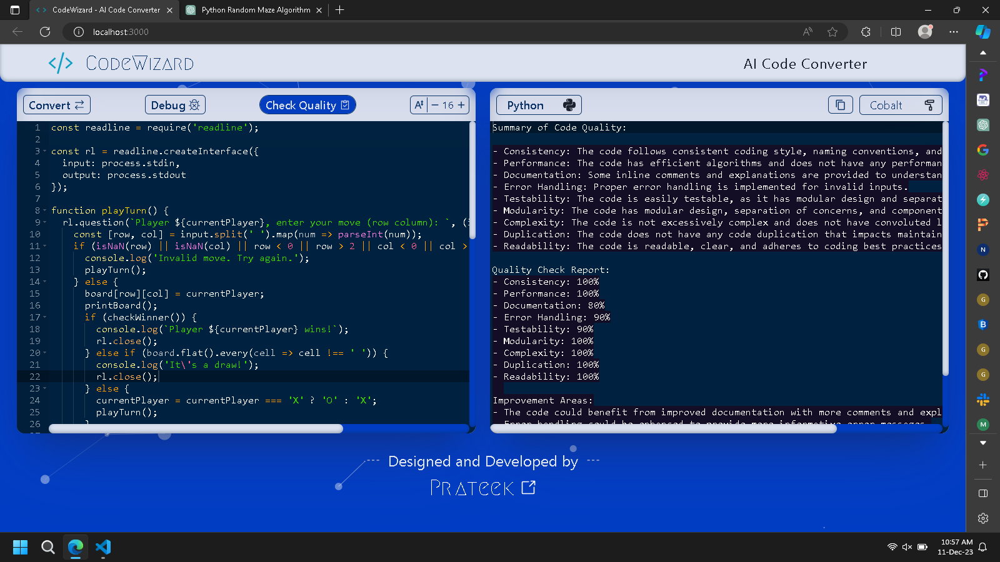
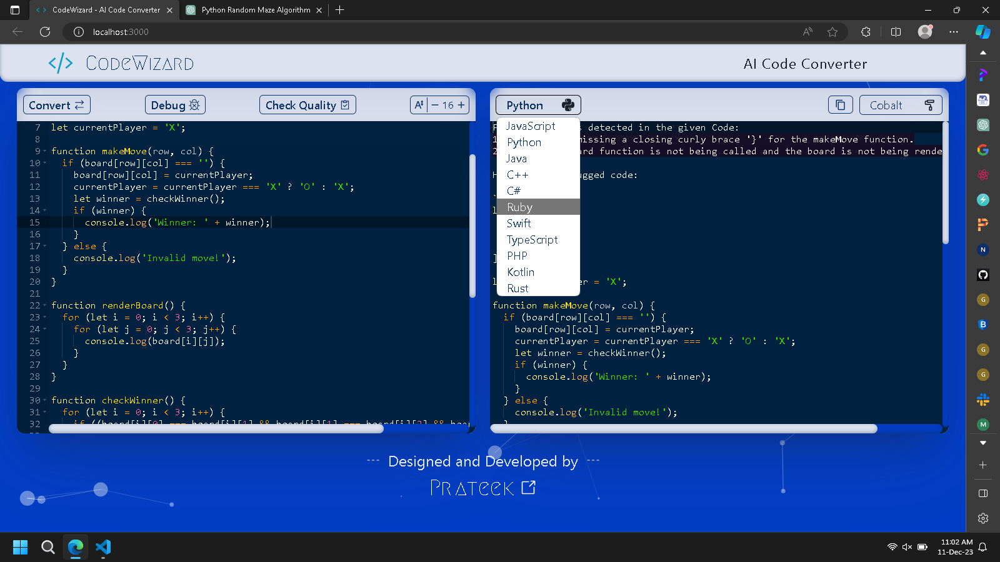
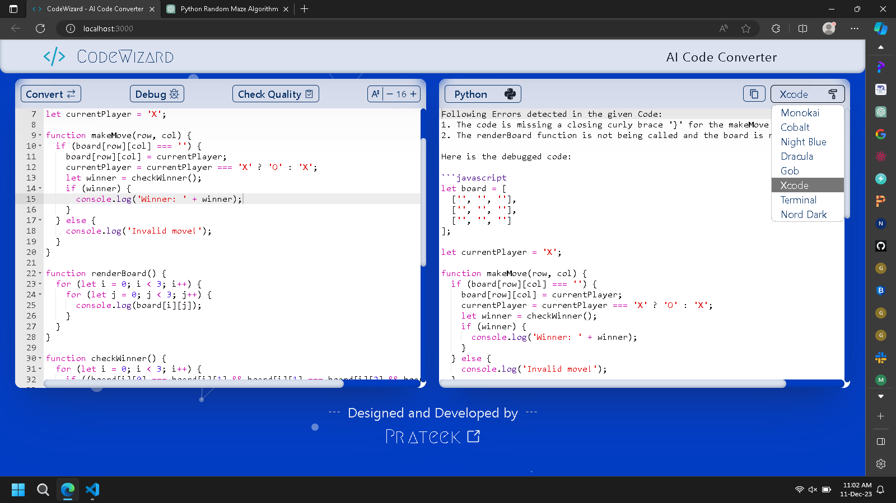

# <a href="https://codewizard-khaki.vercel.app" >CodeWizard</a>

 


#### <h4 align="justify" >CodeWizard is an AI powered go-to platform for code writing, translation across multiple programming languages, debugging, and quality assessment. Simplify your coding experience and unlock efficiency with CodeWizard's intelligent functionalities.</h4>

## Features :-

- Seamless cross-language code translation.
- Built-in code debugger.
- Comprehensive code quality assessment and reporting.
- User-friendly code writing, conversion, and debugging capabilities.
- Utilization of OpenAPI for generating detailed quality reports.
- Agile adaptation to new technologies using Generative AI.

## Tech Stacks Used :-

    

## Installation :-


### Clone Repo :
```
git clone https://github.com/prateekshuklaps0/CodeWizard-AI-Code-Converter
```
### Install Dependencies :
#### `cd Front-End`
#### `npm install`
### Start the front-end Server :
#### `npm run dev`


<h3 align="center">Effortless Code Translation</h3>




<h3 align="center">AI-Powered Debugging Insights</h3>




<h3 align="center">Code Quality Check Metrics</h3>




<h3 align="center">Multi-Programming Language Support</h3>




<h3 align="center">Various Themes Selection Options</h3>


